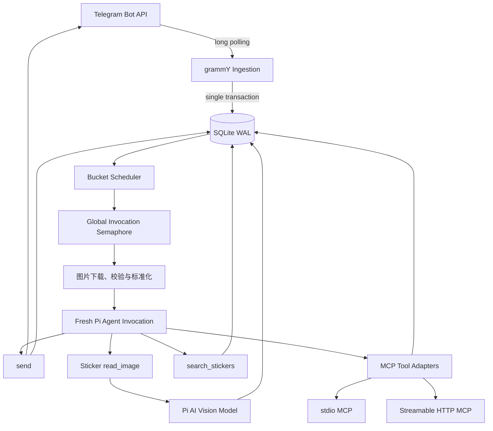
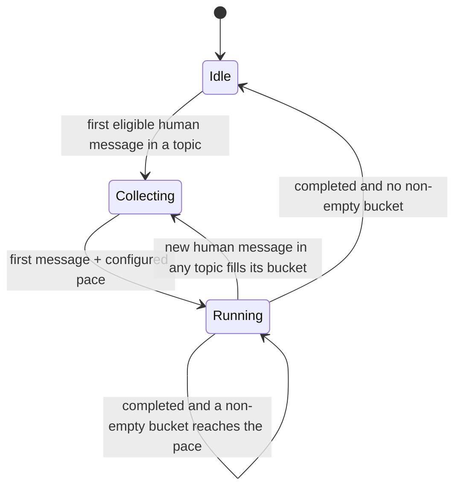

# 塑料碗 Telegram Bot Phase 1 技术设计

## 1. 文档边界

本文定义 Phase 1 的技术实现。产品行为与验收标准以《20260815 塑料碗 Telegram Bot 设计方案》为准。

目标是用一个长期运行的 VPS 进程实现：

- Telegram long polling 接入；
- 每 Conversation 使用全局可配置长度的固定 Message Bucket；
- 每轮重建短期 Context 的 Agent Invocation；
- 只能通过受限 Tool 产生外部副作用；
- Photo/图片 Document 直传多模态 Agent，Sticker 按需单帧理解；
- 管理员许可 Sticker Set 的检索与发送；
- MCP Tools 接入；
- SQLite 持久化、审计、预算、恢复与备份。

Phase 1 不使用 Vercel AI SDK，不部署到无状态或 Serverless 运行时，不实现长期记忆、Embedding、RAG 或 Web 审计界面。

---

## 2. 技术选型

| 领域 | 选择 | 说明 |
|---|---|---|
| 语言与运行时 | TypeScript + Bun | 单进程长期运行 |
| Telegram | grammY | 顺序 long polling；middleware 只负责持久化 Update |
| Agent loop | `@earendil-works/pi-agent-core` | 每次 Invocation 创建独立 Agent |
| 模型接口 | `@earendil-works/pi-ai` | Provider Registry 同时支持 Pi AI 内建 Provider 与显式 endpoint/API adapter 的自定义 Provider |
| 数据库 | `bun:sqlite` | 原生 SQL、显式事务，不引入 ORM |
| Schema 校验 | TypeBox | 同时复用 Pi Agent Tool 的 JSON Schema 类型 |
| TOML | `Bun.TOML` | 配置版本固定为 `version = 1` |
| MCP | `@modelcontextprotocol/sdk` | 支持 stdio 与 Streamable HTTP；仅启用 Tools |
| 静态图片 | `sharp` | 格式检查、缩放、自动旋转、移除元数据 |
| WEBM 单帧 | `ffmpeg` | Thumbnail 缺失时取时间中点 |
| TGS 单帧 | `python-lottie` 的 `lottie_convert.py` | Thumbnail 缺失时按中间 frame 输出 PNG |
| 进程管理 | systemd | 原生 VPS 部署、自动重启、独立 backup timer |

所有直接依赖必须精确锁定版本并提交 Bun lockfile。Pi Agent Core 与 Pi AI 使用同一发布系列，避免跨版本 Message/Tool 类型不兼容。

---

## 3. 运行拓扑



只有一个 `serve` 进程可以持有运行锁。每日备份由独立 systemd timer 调用同一程序的 `backup` 子命令；备份进程只建立 SQLite 读连接，不参与 Telegram long polling。

---

## 4. 配置

### 4.1 加载规则

- 配置格式为 TOML，必须包含 `version = 1`。
- 使用 `Bun.TOML` 解析，再以 TypeBox 严格校验。
- 未知字段、重复 alias、无效 Chat ID、无效 IANA timezone、预算缺失、未知 API adapter、无效 endpoint 或模型能力不匹配均导致启动失败。
- 配置仅在启动时加载，不热重载。修改后通过 systemd 重启。
- 配置文件权限必须为 `0600`，父目录为 `0700`。
- 程序不得自动改写配置文件。

### 4.2 SecretRef

所有密钥字段统一接受三种形式：

```toml
api_key = "sk-aaaaaaaa"
api_key = { env = "OPENAI_API_KEY" }
api_key = { command = ["security", "find-generic-password", "-w", "-s", "openai"] }
```

约束：

- `command` 必须是 TOML 字符串数组；第一个元素为可执行文件，其余为 argv。
- 使用 `Bun.spawn(argv)`，绝不经过 Shell，不进行变量插值。
- 只在 `serve`/`doctor` 启动阶段执行。
- 默认 5 秒超时，stdout 最大 4 KiB，只移除一个末尾换行。
- stderr、stdout、解析后的 Secret 不进入 journald、SQLite 审计或 Agent Context。
- 子进程只继承运行所需的最小环境；不会继承其他模型或 Telegram 密钥。
- 内存中维护已解析 Secret 集合，用于在错误文本入库前做精确脱敏。

### 4.3 Provider Registry

`providers` 是独立 Registry。`agent.provider` 与 `vision.provider` 只引用 Registry alias，不重复保存 endpoint、认证或模型目录。

Registry 支持两类 Provider。

#### 内建 Provider

```toml
[providers.vision_openai]
kind = "builtin"
provider = "openai"
api_key = { env = "OPENAI_API_KEY" }
```

- `provider` 必须是应用显式注册的 Pi AI 内建 Provider ID；
- endpoint、API adapter 与模型 metadata 使用 Pi AI 内建定义；
- 不允许在 `kind = "builtin"` 上覆盖 `base_url` 或 `api`；需要自定义 endpoint 时必须创建独立 custom alias。

#### 自定义 Provider

```toml
[providers.primary_relay]
kind = "custom"
base_url = "https://relay.example.com/v1"
api = "openai-responses"
api_key = { env = "RELAY_API_KEY" }

[providers.primary_relay.headers]
X-Project = { env = "RELAY_PROJECT" }

[[providers.primary_relay.models]]
id = "relay-model"
name = "Relay Model"
reasoning = true
input = ["text", "image"]
context_window = 200000
max_tokens = 32768
cost = { input = 1.0, output = 5.0, cache_read = 0.1, cache_write = 1.0 }
```

Phase 1 的 custom Provider 只接受已编译并测试的 API adapter：

- `openai-responses`；
- `openai-completions`；
- `anthropic-messages`。

未知字符串必须导致启动失败，不能根据 URL、模型名或响应形状猜协议。一个 custom Provider alias 只使用一种 API adapter；同一 endpoint 同时提供多个协议时，应配置多个 alias。

`base_url` 是 API 根路径，不是完整方法 URL。OpenAI Responses、Chat Completions 与 Anthropic Messages 的具体方法路径分别由 adapter 添加。应用不自动补 `/v1`，只移除末尾 `/`；URL 必须是绝对 HTTP/HTTPS URL，且不得包含 query 或 fragment。

自定义模型 metadata 必须完整声明：`id`、`reasoning`、`input`、`context_window`、`max_tokens` 与四类费用。应用将其转换成 Pi AI `Model` 的 `api`、`provider`、`baseUrl`、`contextWindow`、`maxTokens` 与 `cost` 字段，再通过 `createProvider`/`models.setProvider` 注册。配置向导可携带已解析的 `api_key` 与附加 Header 请求 `${base_url}/models`，但只把通过 Schema 校验的模型 ID 作为候选项；模型能力、限制与费用仍必须由 models.dev 或管理员补全，不能根据 URL、模型名或响应形状推断。

附加 Header 的值复用 SecretRef。标准 Authorization 由对应 API adapter 和 `api_key` 生成；配置中的 Header 用于网关额外认证或路由，不进入 Agent Context 或审计正文。

### 4.4 配置示例

数值只是结构示例；预算字段必须由管理员明确填写，不提供无限默认值。

```toml
version = 1
data_dir = "/var/lib/plasticwan"
timezone = "Asia/Shanghai"

[telegram]
token = { env = "TELEGRAM_BOT_TOKEN" }
process_bot_messages = false
bucket_window_seconds = 15

[providers.primary_relay]
kind = "custom"
base_url = "https://relay.example.com/v1"
api = "openai-responses"
api_key = { env = "RELAY_API_KEY" }

[providers.primary_relay.headers]
X-Project = { env = "RELAY_PROJECT" }

[[providers.primary_relay.models]]
id = "relay-model"
name = "Relay Model"
reasoning = true
input = ["text", "image"]
context_window = 200000
max_tokens = 32768
cost = { input = 1.0, output = 5.0, cache_read = 0.1, cache_write = 1.0 }

[providers.vision_openai]
kind = "builtin"
provider = "openai"
api_key = { command = ["pass", "show", "plasticwan/openai"] }

[agent]
provider = "primary_relay"
model = "relay-model"
daily_budget = { max_tokens = 600000 }
max_output_tokens = 4096
thinking_level = "low"
system_prompt = """
你是参与 Telegram 对话的 Agent。根据当前对话决定是否参与。
"""
max_turns = 8
max_tool_calls = 12
max_sends = 6
timeout_seconds = 90
max_concurrency = 4
context_stop_ratio = 0.8
history_messages = 20

[vision]
provider = "vision_openai"
model = "gpt-5.2"
max_output_tokens = 2048
max_concurrency = 2
background_sticker_concurrency = 1
prompt_version = 1

[vision.daily_budget]
max_tokens = 200000
max_images = 200

[retention]
online_days = 30
backup_copies = 7

[paths]
database = "/var/lib/plasticwan/plasticwan.sqlite"
media_cache = "/var/lib/plasticwan/media"
backups = "/var/lib/plasticwan/backups"

[[telegram.chats]]
id = 123456789
timezone = "Asia/Shanghai"
instructions = "这是私聊。默认积极回应。"
budget = { max_invocations_per_day = 100 }

[[telegram.chats]]
id = -1001234567890
topic_ids = [3, 8]
instructions = "这是群聊。没有明确价值时保持沉默。"
budget = { max_invocations_per_day = 200 }

[[telegram.sticker_sets]]
alias = "cat_pack"
name = "ActualTelegramStickerSetName"

[[mcp.servers]]
alias = "search"
transport = "stdio"
command = ["bunx", "-y", "example-search-mcp"]
required = true
tools = ["web_search"]
payload_max_bytes = 1048576
result_max_bytes = 32768

[mcp.servers.env]
SEARCH_API_KEY = { env = "SEARCH_API_KEY" }

[[mcp.servers.tool_policies]]
name = "web_search"
read_only = true
timeout_seconds = 30
per_chat_daily_calls = 50
global_daily_calls = 500

[[mcp.servers]]
alias = "remote"
transport = "streamable_http"
url = "http://10.0.0.20:8080/mcp"
follow_redirects = false
required = false
tools = "*"
payload_max_bytes = 1048576
result_max_bytes = 32768
default_tool_policy = { read_only = false, timeout_seconds = 30, per_chat_daily_calls = 10, global_daily_calls = 100 }

[mcp.servers.headers]
Authorization = { env = "REMOTE_MCP_AUTHORIZATION" }
```

### 4.5 Chat 配置语义

- 私聊、Group、Supergroup 通过 `chat_id` allowlist。
- Forum Group 可选 `topic_ids`；缺失表示允许全部 Topic。
- Conversation Key 为 `(chat_id, message_thread_id)`。
- 不同 Topic 的短期 Context、Bucket 和 Invocation 隔离。
- 每日 Agent/MCP 预算按 `chat_id` 汇总，不因 Topic 数量扩大。
- 数据库存储 Telegram 可信迁移事件产生的旧、新 Chat ID 映射；旧 ID 已允许时，新 ID 自动继承授权，并在运行日志中提示管理员更新 TOML。
- 全局 timezone 必填，Chat 可以覆盖；消息时间在 Prompt 中按 Chat timezone 展示，数据库与每日预算统一使用 UTC。

---

## 5. SQLite

### 5.1 连接设置

```sql
PRAGMA journal_mode = WAL;
PRAGMA synchronous = FULL;
PRAGMA foreign_keys = ON;
PRAGMA busy_timeout = 5000;
```

数据库以：

```ts
new Database(path, {
  create: true,
  strict: true,
  safeIntegers: true,
});
```

打开。所有 Telegram ID、Message ID、Update ID 与内部整数主键在 TypeScript 中使用 `bigint`，对 Prompt/JSON 输出时显式转为十进制字符串，避免隐式精度损失。

### 5.2 Migration

- Migration 是随程序发布的编号 SQL 文件。
- 启动取得单实例锁后，先生成一致性迁移前备份，再在事务中单向执行未应用 Migration。
- Migration 失败则拒绝启动；不自动降级、不删除重建数据库。
- 通过 `schema_migrations(version, applied_at)` 记录版本。

### 5.3 主要表

| 表 | 作用 | 关键约束 |
|---|---|---|
| `app_state` | 首次启动、清理、备份等游标 | key 唯一 |
| `telegram_updates` | Update 去重与允许 Chat 的 raw JSON | `update_id` 唯一；未知 Chat 不保存 raw JSON |
| `chats` | Chat 元数据与迁移后的 canonical Chat | Telegram Chat ID 唯一 |
| `chat_migrations` | Group → Supergroup ID 映射 | old/new ID 唯一 |
| `conversations` | 私聊、群聊或 Forum Topic | `(chat_id, message_thread_id)` 唯一 |
| `senders` | Telegram User/SenderChat 当前元数据 | Telegram 类型与 ID 唯一 |
| `messages` | Telegram 消息稳定身份与当前 Revision | `(chat_id, telegram_message_id)` 唯一 |
| `message_revisions` | 正文、Caption、媒体、Reply、Forward 的每个版本 | `(message_id, revision_no)` 唯一 |
| `media` | Photo/Document/Sticker 的 Telegram 引用与类型 | 保存 `file_id`、`file_unique_id`、MIME、尺寸 |
| `buckets` | 配置长度窗口与排队状态 | 每个 Conversation 一个 `collecting` Bucket（Topic 各自收集），同一 Chat 的会话串行启动 |
| `bucket_messages` | Bucket 中的稳定 Message 身份 | `(bucket_id, message_id)` 唯一 |
| `invocations` | Agent Invocation 生命周期与预算结果 | 同一 Chat 最多一个 `running` Invocation，数据库按 Conversation 约束 |
| `invocation_messages` | 实际进入 Context 的 Message Revision 快照 | 保存 history/new、顺序、省略信息 |
| `model_calls` | 每次主模型/视觉模型请求 | Usage、费用、重试、错误、耗时 |
| `agent_messages` | 完成后的 Assistant/Tool Result 消息 | 不存流式 delta；thinking 正文为空 |
| `tool_calls` | Tool 参数、结果、状态和副作用分类 | `tool_call_id` 唯一 |
| `telegram_sends` | text/sticker 出站请求与 Telegram 响应 | pending/success/error/outcome_unknown |
| `media_analyses` | 普通图片与 Sticker 的版本化视觉描述 | `(file_unique_id, analysis_version)` 唯一 |
| `sticker_sets` | 配置 Set 与同步状态 | alias、Telegram set name 唯一 |
| `stickers` | Set 中 Sticker、当前 file_id、emoji 与状态 | `file_unique_id` 唯一 |
| `sticker_search` | Sticker 描述 FTS5 索引 | FTS5 trigram；短于 3 字符查询回退参数化 `LIKE` |
| `daily_usage` | Chat、视觉系统预算与 MCP Tool 计数 | `(utc_date, scope, resource, metric)` 唯一 |

### 5.4 状态值

Bucket：

```text
collecting → queued → running → completed
                    ├────────→ failed
                    ├────────→ aborted
                    └────────→ outcome_unknown
collecting/queued → merged
collecting/queued → expired
collecting/queued → skipped_budget
```

Tool Call：

```text
pending → success | error | outcome_unknown | blocked_budget
```

状态迁移必须和对应审计记录位于同一 SQLite 事务。网络调用不能持有数据库事务；调用前提交 `pending`，调用后以新事务写最终状态。

---

## 6. Telegram Ingestion

### 6.1 long polling

- 使用 grammY 的顺序 `bot.start()`，不使用 runner 并发处理 Update。
- `allowed_updates` 只包含 Phase 1 需要的 `message`、`edited_message` 与 `my_chat_member`。
- middleware 只做校验、去重、规范化和 SQLite 事务，不等待 Bucket、不调用模型。
- 事务成功后 middleware 才返回，grammY 才可推进 Telegram offset。
- 进程在提交后、确认前崩溃会收到重复 Update；`telegram_updates.update_id` 唯一约束使重复处理成为 no-op。
- 数据库提交失败属于致命错误：停止 long polling 并退出，让 systemd 重启，不能吞掉错误后确认 Update。

### 6.2 首次启动

数据库中的 `telegram_initialized` 标记控制首次启动：

1. 验证 Bot Token 并调用 `getMe`；
2. 删除旧 webhook；
3. 首次部署显式丢弃 Telegram 已积压 Update；
4. 成功后写入初始化标记；
5. 后续普通重启不再 drop pending updates。

操作顺序必须保证初始化中途崩溃后仍会重新执行 drop，而不会误进入普通恢复路径。

### 6.3 allowlist

收到 Update 后先提取 Chat/Topic 身份，再决定是否保留正文：

- 未允许 Chat/Topic：只保存 `update_id`、Chat ID、Chat 类型、接收时间、拒绝原因；不保存正文、用户资料、raw JSON 或媒体引用。
- 已允许 Chat/Topic：保存 raw JSON 30 天，再规范化。
- Channel post 永远忽略。

### 6.4 消息规范化

完整支持：

- text；
- photo；
- MIME 为 `image/jpeg`、`image/png`、`image/webp` 且 Telegram 报告不超过 20 MB 的 document；
- static WEBP、animated TGS、video WEBM sticker；
- caption、reply、forward、media group、edited message。

其他真人消息保存为 `unsupported` 占位并可触发 Bucket。Service Message 只加入已经由真人触发的 collecting Bucket。其他 Bot 消息由 `process_bot_messages` 控制：关闭时完全忽略，开启后只能加入真人已触发 Bucket。自己发送的 Update 始终忽略；自己的出站消息在 Telegram API 成功后由应用直接写入历史。

Reply 目标不在最近历史时，规范化层保存一层紧凑引用快照：Message ID、发送者、截断正文或媒体占位。不递归展开 Reply。

Forward 消息的发送者仍是当前转发者；只保存 Telegram 公开提供的 `forward_origin`，不推断隐藏来源。

### 6.5 edited_message

- 首次消息创建 `messages` 与 revision 1。
- 每个 `edited_message` 追加 Revision，并原子更新 `messages.current_revision_id`。
- 编辑不创建 Bucket、不延长配置窗口。
- Bucket 截止时读取当时 current revision，写入 `invocation_messages` 后冻结。
- 截止后到达的编辑只影响未来历史。
- Telegram Bot API 不提供通用 `getMessage` 或普通消息删除事件，因此系统不主动检查消息删除。

---

## 7. Bucket Scheduler

### 7.1 Conversation 状态机



- 节拍通过全局 `telegram.bucket_window_seconds` 配置为 0–300 的整数秒，不按 Chat 覆盖，按 Chat 串行；`0` 仅取消新消息的额外等待，不创建空会话。
- 空闲 Chat 的首次 deadline 为第一条 eligible human message 的 `received_at + bucket_window_seconds`；不同 Topic 的 Bucket 各自持有 deadline。
- Chat 内任意 Invocation 运行期间，各 Topic 只收集一个下一 Bucket。下一启动时间为 `max(previous started_at + bucket_window_seconds, previous finished_at)`，按 Chat 计算。
- 使用数据库驱动的单一调度器：查询最近 deadline，等待；新建更早 deadline 或 Invocation 结束时唤醒。
- deadline 与状态持久化；不为每个 Chat 创建独立 `setTimeout`。

### 7.2 截止

调度器用短事务完成：

1. 确认到期 Bucket 的 Chat 没有 queued/running Invocation；
2. 查询每条 Message 当前 Revision；
3. 写不可变 Invocation 输入快照；
4. 将 Bucket 设为 `queued`；
5. 提交后交给 Invocation queue。

当前 Bucket 自身超出输入预算时，所有消息仍入库，但 Prompt 从最新消息向前装入；在 `new_messages` 起始处写明确的省略数量。一个 Bucket仍然只调用 Agent 一次。

### 7.3 串行与节拍

- 同一 Chat 最多一个 queued/running Invocation；不同 Chat 之间不受影响，可并发。
- Chat 内任意 Invocation 运行时，各 Topic 的新真人消息进入各自的 collecting Bucket。
- 当前 Invocation 短于节拍时，下一 Bucket 等到节拍边界；长于节拍时，结束后立即处理下一 Bucket。
- 下一 Bucket 为空时不创建 Invocation。
- 达到 Chat 日预算时，到期 Bucket 标记 `skipped_budget`；消息仍进入历史，不排队到次日。

### 7.4 重启恢复

启动扫描：

- `collecting` 且 deadline 未到：等待剩余时间；
- `collecting/queued` 已到期且最老消息不超过 5 分钟：立即排队；
- 超过 5 分钟：标记 `expired`，不调用 Agent；
- 崩溃时为 `running` 的 Invocation：标记 `aborted` 或 `outcome_unknown`，不自动重放；
- 未开始的有效 Bucket 可以恢复。

---

## 8. Context 与 Agent Invocation

### 8.1 每轮重建

每次 Invocation 创建新的 Pi `Agent`。共享的只有只读模型注册表、Tool definitions 与服务 clients；Agent state、Context、调用期媒体引用完全隔离。

输入顺序：

1. 代码拥有的安全与能力边界；
2. 管理员全局 persona；
3. 私聊或群聊参与策略；
4. Chat 静态 instructions；
5. Chat timezone 下的当前时间；
6. 最近 20 条 Telegram 可见历史；
7. 当前 Bucket。

未发布 Assistant Message、Tool Call、Tool Result 与内部 reasoning 不进入下一次 Invocation。Bot 成功发送的 text/sticker 作为 Telegram 可见消息进入历史。

### 8.2 历史计数

- 一个 Telegram `message_id` 算一条。
- Photo、Sticker、Document 与 Caption 属于同一条。
- Reply 引用快照不额外计数。
- 当前 Bucket 不占 20 条历史额度。
- 历史从新到旧选择，再按时间正序交给模型。
- 不做跨 Invocation 摘要或 compact。

### 8.3 Prompt 数据边界

Telegram 消息、视觉描述和 MCP 结果都明确标记为不可信数据。用户内容不得拼入代码拥有的安全规则或 Tool description。

Tool 权限、Chat allowlist、引用授权、预算与参数限制全部在代码中执行，不依赖模型遵守 Prompt。

### 8.4 运行限制

每次 Invocation：

- 90 秒总时限；
- 最多 8 个 Agent turn；
- 最多 12 个 Tool Call；
- 最多 6 个 `send`；
- 所有 Tool 按模型给出的顺序执行；
- `max_output_tokens` 由 TOML 必填并在启动时验证；
- 主模型固定为全局单模型，不自动切换 Provider 或 fallback 模型。

同一模型调用遇到明确的瞬时错误时最多重试 2 次，指数退避并受 90 秒总时限约束。仅在该 Assistant Message 尚未完成、新 Tool 尚未执行时重试。整个失败 Bucket 不做延迟重放。

### 8.5 80% Context 保护

Pi AI Model metadata 提供 context window，Provider response 提供实际 Usage。第一次调用前使用保守字符估算，后续使用上一轮实际 input Usage 加新增 Tool Result 估算。

达到 context window 80% 后：

- 移除 `read_image`、`search_stickers` 与 MCP Tools；
- 允许一次只含 `send` 或结束的收尾模型调用；
- 收尾后强制停止；
- 不删除已有 Tool Call/Result，不破坏 Provider 消息配对。

如果剩余空间不足安全发起收尾调用，则直接终止并记录 `context_limit`。

### 8.6 Assistant 输出

Pi Agent 的普通 Assistant 文本永不自动发布到 Telegram。只有 `send` Tool 有出站能力。没有调用 `send` 是正常完成状态，不视为错误。

Bot 不发送 typing action，不对连续发送增加人为延迟。

---

## 9. Built-in Tools

### 9.1 `send`

参数使用联合类型，`kind` 区分发送类型：

```ts
type SendInput =
  | {
      kind?: "text";
      text: string;
      reply_to_message_id?: string;
    }
  | {
      kind: "sticker";
      sticker_ref: string;
      reply_to_message_id?: string;
    };
```

规则：

- 仅提供 `text`（以及可选的 `reply_to_message_id`）时，`kind` 默认为 `"text"`；Sticker 仍必须显式指定 `kind: "sticker"`；
- text 为纯文本，不设置 Telegram `parse_mode`；
- text 必须满足 Telegram 单条长度限制，超长返回 Tool Error，不截断、不拆分；
- `reply_to_message_id` 必须来自当前 Conversation 的可见 Context；
- Forum Topic 的 `message_thread_id` 由 Invocation 自动附加，Agent 不能改写；
- `sticker_ref` 必须由本次 Invocation 的 `search_stickers` 返回；
- Agent 不能传任意 file_id、Chat ID、Topic ID 或 Sticker Set name；
- text 与 sticker 都消耗一次 6 次发送配额。

发送事务：

1. 写 `tool_calls.pending` 与 `telegram_sends.pending`；
2. 提交事务；
3. 调用 Telegram；
4. 明确成功：写响应 Message ID、状态 success，并插入 Telegram 可见历史；
5. Telegram 明确 429：仅在 `retry_after` 不越过 Invocation deadline 时重试；
6. 参数错误等明确失败：写 error；
7. 连接超时、断线、未知 5xx：写 `outcome_unknown`，不自动重试。

Reply 目标不存在时返回 Tool Error，不降级成普通消息。

### 9.2 按主模型能力分流图片

Telegram Photo 与 JPEG/PNG/WebP 图片 Document 只有在主 Agent 模型声明 image 输入能力时才直接加入首轮 User Message；否则暴露为 Invocation-scoped `image_ref`，由 `read_image` 调用独立 Vision 模型。Photo 只在入库时保留 Telegram 尺寸数组中的最后一个最高分辨率变体。

两条路径共用受控图片管线：

1. 通过 `getFile` 下载到权限 `0700` 的临时目录；
2. `sharp` 检查真实格式、限制 decoded pixels、自动旋转、移除元数据、最长边缩放到 2048 px；
3. 不透明照片输出 JPEG，透明图输出 PNG；
4. image-capable Agent 获得 base64 图片；text-only Agent 的 `read_image` 获得 Vision 文字描述；
5. `finally` 删除下载文件和中间文件。

直传下载、格式或像素校验失败会使 Invocation 失败，不能静默省略。普通图片 `read_image` 分析按 `file_unique_id + analysis_version` 缓存 30 天。

`read_image` 接受当前 Context 授权的普通图片或 Sticker 随机引用，不能接受 URL、路径、Telegram file_id 或其他 Chat 的媒体。Sticker 始终使用独立 Pi AI vision model；普通图片只在主模型缺少 image 能力时可被授权。前台调用受 30 秒超时、Chat Token 预算和全局视觉 semaphore 控制。

### 9.3 Sticker 单帧

选择顺序：

1. Telegram Sticker Thumbnail；
2. static WEBP 原图；
3. video WEBM 使用 `ffprobe` 读取时长，`ffmpeg` 提取时间中点 PNG；
4. animated TGS 解压读取 `ip`/`op`，取中间 frame，调用 `lottie_convert.py input.tgs output.png --frame N`。

所有外部媒体命令使用固定可执行文件与固定 argv，不经过 Shell；设置 30 秒超时、输出大小限制和临时目录。输出再经过 `sharp` 标准化。

### 9.4 `search_stickers`

```ts
type SearchStickersInput = {
  query: string;
  set?: string;
  limit?: number;
};
```

- `query` 必填且有长度上限；
- `set` 只能是配置 alias；
- `limit` 默认 5，最大 10；
- 只搜索当前配置仍许可且索引成功的 Sticker；
- 使用 FTS5 trigram 搜索中文描述、情绪、动作、中英文标签与 emoji；少于 3 字符时使用参数化 `LIKE`；
- 返回短描述、emoji 与 Invocation-scoped `sticker_ref`；
- 不返回 Telegram file_id。

Sticker Set 在启动后同步 `getStickerSet`。新增 Sticker 进入后台视觉队列，删除 Sticker 标记 inactive。视觉索引单并发、可恢复、受独立系统日预算限制；聊天 `read_image` 优先占用全局视觉并发槽。

缓存 key 包含 `file_unique_id`、vision provider/model 与 `prompt_version`。配置变化时旧索引继续服务，新版后台完成后原子替换。

---

## 10. MCP

### 10.1 范围

使用官方 TypeScript SDK，只启用：

- initialization/lifecycle；
- tool discovery；
- tool call；
- stdio transport；
- Streamable HTTP transport。

不注册 Resources、Prompts、Sampling、Elicitation。Server 发送相关请求时返回不支持。

### 10.2 静态授权

- Server 只能由 TOML 配置，Bot Command、聊天内容和 Agent 都不能新增或修改。
- 对 Agent 暴露的名称固定为 `<server_alias>__<tool_name>`。
- 内建 `send`、`read_image`、`search_stickers` 不加 MCP namespace。
- `tools = ["..."]` 时启动严格校验：缺失 Tool 导致 required Server 启动失败，额外 Tool 不暴露。
- `tools = "*"` 表示管理员显式信任该 Server 当前和未来的全部 Tool。
- wildcard Server 必须配置 `default_tool_policy`；新增 Tool 默认 `read_only = false`，并继承超时与双重日调用上限。逐 Tool policy 可以覆盖。

全部内建与 MCP Tool schema：

- 最多 64 个；
- 序列化估算不得超过主模型 Context 的 10%；
- 启动超限则失败并列出来源；
- wildcard 运行时更新导致超限时，拒绝整次 registry 更新，继续使用上一份有效 registry，并记录 degraded 状态。

### 10.3 传输

stdio：

- command 是固定 argv，不经 Shell；
- 只注入 Server 配置声明的环境与最小运行环境；
- 每个 Server 一个长期进程与 Client；
- Server 必须是无隐式会话状态的 Tool 服务；
- 不保存或转发 stderr 原文，只记录字节数与退出码。

Streamable HTTP：

- URL 可以是管理员配置的任意静态 HTTP/HTTPS URL；
- Agent 不能修改 URL、Header、session 或 Origin；
- 禁止 HTTP redirect；
- HTTPS 使用运行时默认 TLS 验证，不提供跳过证书校验选项；
- 认证 Header 复用 SecretRef，永不进入 Agent Context 或日志。

每个 Server 全局共享一个 client/session，并按 Server 串行执行 Tool Call。不同 Server 可以并行服务不同 Invocation，但单个 Invocation 内所有 Tool 仍按模型顺序执行。

### 10.4 资源限制

- 单个 Tool 默认 30 秒，可由 policy 调整但不能超过 Invocation 剩余时限；
- stdio 单个 JSON-RPC 消息与 HTTP 单次调用累计 payload 硬上限 1 MiB；
- 超限立即中止连接并把 Server 标记 degraded；
- 成功 Tool Result 给 Agent 前按 UTF-8 截断到 32 KiB并添加显式截断标记；
- Tool 参数也有 32 KiB JSON 上限；
- 所有 JSON Schema 输入在执行前校验。

### 10.5 副作用与预算

每个 Tool policy 必须具有：

- `read_only`；
- `timeout_seconds`；
- `per_chat_daily_calls`；
- `global_daily_calls`。

未声明一律按有副作用处理。调用前在 SQLite 中原子检查并占用 per-Chat 与 global 次数，因此不会因并发突破调用次数上限。

- read-only Tool 遇到明确瞬时错误时可在总时限内重试一次；
- 有副作用 Tool 不自动重试；
- 超时或断线导致结果未知时记录 `outcome_unknown`；
- MCP annotations 只用于审计，不覆盖 TOML 的副作用分类。

### 10.6 故障恢复

- `required = true` 只约束启动阶段；初始化失败则 Bot 不启动。
- `required = false` 初始化失败时 Bot 以 degraded 状态启动，不暴露该 Server 的 Tools。
- 运行中进程退出、HTTP session 失效或连接断开：当前 Tool 返回错误，后台有界指数退避重连；Bot 与其他 Server 继续运行。
- 重连成功只影响未来 Tool Call，不重放已经 outcome_unknown 的调用。

---

## 11. 预算与并发

### 11.1 Invocation 并发

- 全局最多 4 个 running Invocation，TOML 可调。
- 同一 Conversation 永远最多 1 个 running Invocation。
- 同一 `chat_id` 下主模型与聊天触发的 Sticker 视觉模型调用共享模型闸门；不同 Topic 的 Invocation 可以在等待 Tool 等阶段并发。
- 全局 Agent 日 Token 上限可能被已放行的并发模型调用小幅超出。

### 11.2 Agent 日 Token 预算与 Chat 日调用预算

每个 allowlist Chat 必须配置 `max_invocations_per_day`，用于限制该 Chat 每日创建的 Invocation 数量。Chat 不设 Token 硬上限。

`agent.daily_budget.max_tokens` 是所有 Chat 共享的全局日 Token 上限。主 Agent 与聊天触发的 Sticker `read_image` Usage 都计入该上限；同时继续按 Chat 写入 `daily_usage`，保留 input、output、cache read、cache write 与费用拆分审计。

Provider 在响应后才返回准确 Usage，因此每次模型调用前检查全局已消费量，调用完成后按 Chat 归属记账。达到上限后禁止后续模型调用；已放行的并发调用可能造成小幅超额。全局剩余比例低于 5% 时，运行中的 Agent 可调用 `zzz` 进入全局睡眠，并在下一次 UTC 日预算重置后恢复。

### 11.3 Sticker 系统预算

后台 Sticker 索引使用独立全局日预算：最大视觉 Token 与最大图片数。用尽后暂停，次日 UTC 从持久化游标继续。不会消耗任一 Chat 预算。

### 11.4 MCP 预算

每个 MCP Tool 调用前原子占用：

- 当前 `chat_id` 当日调用次数；
- Tool 全局当日调用次数。

任一达到上限即返回 `blocked_budget` Tool Error，不发起外部请求。

---

## 12. 审计与保留

### 12.1 入库内容

保存：

- allowlist Chat 的 raw Telegram Update 与规范化结果；
- Message Revision；
- Bucket deadline、合并、过期与预算跳过；
- 实际 Invocation Context 中采用的 Revision；
- 每个完成的 Assistant Message；
- Tool 参数、裁剪后的结果、状态、错误和耗时；
- Telegram send 请求类型、响应 Message ID 与 unknown 状态；
- 每次模型调用的 Usage、费用、重试与模型身份；
- 配置 hash、Prompt version、Tool registry hash 与 media analysis version。

不保存：

- 流式 text delta；
- reasoning/thinking 正文；
- SecretRef 解析值；
- MCP stderr 原文；
- Provider 原始 HTTP 请求/响应；
- 未允许 Chat 的正文、用户资料、raw JSON 或媒体引用。

### 12.2 保留

- 在线消息、raw Update、Revision、Prompt、Tool Result 与 Invocation：30 天；
- 普通图片下载文件和中间文件：模型请求载荷构造完成后立即删除；
- 管理员仍许可的 Sticker 代表帧与索引：长期保留；
- Chat、迁移映射、Schema 版本、预算配置身份等运行元数据：持续保留；
- 本地一致性备份：最近 7 份，因此聊天数据在备份中最长约 37 天。

每日清理先删除在线过期数据，再生成新备份并轮换旧备份。

### 12.3 运行日志

journald 只输出：

- stable ID；
- 状态；
- 数量；
- 耗时；
- 错误分类与脱敏摘要。

禁止输出聊天正文、Prompt、Tool 参数/结果、媒体描述、MCP stderr 或 Secret。不存在输出正文的 debug 日志模式。

---

## 13. 故障语义

| 场景 | 行为 |
|---|---|
| Telegram Update 重复 | `update_id` 唯一约束；no-op 后正常确认 |
| Update 入库失败 | 停止 long polling 并退出，不确认该 Update |
| 进程在 Update 提交后崩溃 | Telegram 可能重投；数据库去重 |
| 模型瞬时错误 | 同模型调用最多重试 2 次；不切换模型 |
| Invocation 最终失败 | Bucket 标记 failed；不重放；消息保留为历史 |
| Invocation 超过 90 秒 | Abort；按已发生副作用决定 aborted/outcome_unknown |
| send 明确 429 | 按 `retry_after` 在剩余总时限内重试 |
| send 网络结果未知 | outcome_unknown；不重试、不重放 Invocation |
| MCP read-only Tool 瞬时失败 | policy 允许时重试一次 |
| MCP side-effect Tool 断线 | outcome_unknown；不重试 |
| required MCP 启动失败 | 拒绝启动 |
| MCP 运行中失败 | 当前 Tool error；后台重连；Bot 继续 |
| 视觉模型失败 | Tool Error；临时文件仍在 finally 删除 |
| Sticker 索引失败 | 保存失败次数与下次重试时间，受系统预算继续后台处理 |
| 配置错误或 Secret 解析失败 | 拒绝启动 |
| SQLite corruption/migration failure | 拒绝启动，保留迁移前备份 |

---

## 14. 安全边界

### 14.1 不可信数据

以下全部视为不可信：

- Telegram 正文、Caption、Forward、用户名和文件；
- 图片 OCR 与视觉描述；
- MCP Tool description、参数 Schema 与 Tool Result；
- 模型生成的 Tool 参数。

Prompt 只帮助模型理解边界，真正授权由代码完成。

### 14.2 Agent 不具备的能力

Agent registry 中不存在：

- Bash/Shell；
- 任意代码执行；
- 通用文件读取或写入；
- 通用 HTTP client；
- 任意 Telegram API；
- 任意 Chat/Topic 选择；
- 动态 MCP Server 注册。

### 14.3 Capability reference

`image_ref`、`sticker_ref` 与 Reply allowlist 都是 Invocation-scoped capability：

- 随机、不可预测；
- 只映射当前 Context 或当前 Tool Result；
- Invocation 完成即失效；
- Agent 提交的 Telegram ID/file_id/URL 不被接受。

### 14.4 进程与文件

- systemd 使用专用低权限用户；
- 数据目录 `0700`，数据库、配置和备份 `0600`；
- `NoNewPrivileges=true`，写权限限制到数据目录；
- 媒体与 MCP 子进程使用固定 argv、超时、最小环境；
- SQLite Phase 1 不做应用层加密，依赖 VPS 主机与磁盘安全；
- Streamable HTTP MCP URL 是受信管理员配置，仍禁止 redirect 和 TLS 验证降级。

---

## 15. 部署与运维

### 15.1 VPS 依赖

- 固定版本 Bun；
- `ffmpeg`/`ffprobe`；
- Python 3；
- `python-lottie` 与 PNG 输出依赖；
- systemd。

`doctor` 必须实际验证：

- Bun 与 SQLite FTS5 trigram；
- `sharp` 可加载；
- `ffmpeg`/`ffprobe` 可执行；
- `lottie_convert.py` 能把内置 TGS fixture 转成 PNG；
- 数据目录权限与剩余空间；
- TOML、Secret、Provider Registry 与模型 metadata；
- 每个 custom Provider endpoint 完成一次最小文本请求；
- 主 Agent Provider 完成一次无副作用的严格 Tool Call smoke test；
- Vision Provider 使用内置 1×1 图片完成一次视觉请求；
- Telegram `getMe`；
- required MCP 初始化与 Tool policy；
- Tool schema 数量与 Context 占比。

### 15.2 CLI

```text
plasticwan serve --config /etc/plasticwan/config.toml
plasticwan check-config --config /etc/plasticwan/config.toml
plasticwan doctor --config /etc/plasticwan/config.toml
plasticwan backup --config /etc/plasticwan/config.toml
```

- `check-config` 只解析和做静态校验，不执行网络请求。
- `doctor` 解析 Secret、检查本地依赖并连接 Telegram/required MCP；输出不得包含 Secret 或内容正文。
- `serve` 执行 migration、恢复调度状态、启动 MCP、Sticker index worker 与 long polling。
- `backup` 使用 SQLite `VACUUM INTO` 生成同目录临时文件，设置 `0600` 后原子移动到 backups 目录，再保留最近 7 份。

### 15.3 systemd

Service：

- `Restart=on-failure`；
- 收到 SIGTERM 后先停止 long polling 与新 Invocation；
- 最多等待 active Invocation 30 秒；
- 超时后 Abort，提交最终状态，checkpoint 并关闭 SQLite；
- systemd 的停止超时应大于应用 30 秒窗口。

Timer：

- 每日 UTC 运行 `plasticwan backup`；
- 与 service 并行时依赖 WAL 一致性读；
- 备份失败写 journald 并返回非零，由 systemd 标记失败。

应用只生成本地备份。异地同步属于 VPS 运维层，不向 Bot 增加对象存储凭据。

---

## 16. 验证策略

### 16.1 状态机测试

使用 fake clock、临时 SQLite 和 fake Telegram API 验证：

- 第一条消息创建一个节拍后的 deadline；
- edit 不重置、不创建 Bucket；
- 截止采用最新 Revision；
- 截止后 edit 只影响未来历史；
- Service/other Bot 不能独立触发；
- Forum Topic Context 隔离；
- 同 Chat Invocation 串行，不同 Chat 并发；
- running 期间各 Topic 新消息进入各自的下一 Bucket；
- 短 Invocation 等满节拍，长 Invocation 结束后立即续跑；
- 没有新消息时不创建下一 Invocation；
- 5 分钟内恢复、超过 5 分钟过期；
- Update 重投不重复创建 Message/Bucket。

### 16.2 Context 测试

验证：

- 最近 20 个 `message_id` 的计数规则；
- Bot 成功发送内容进入历史；
- hidden Assistant/Tool Result 不进入下一轮；
- history 与 new messages 分区；
- Reply 单层快照；
- Forward 标记；
- 超大 Bucket 保留最新消息并报告省略数量；
- 80% 后只保留 send 收尾能力。

### 16.3 Tool 测试

`send`：

- 纯文本、Sticker、Reply；
- 非当前 Context Reply 被拒绝；
- 任意 file_id/Chat ID 被拒绝；
- 长文本返回 Tool Error；
- 6 次限制与严格顺序；
- 429 重试；
- 网络未知状态不重试。

媒体：

- JPEG/PNG/WebP 格式、像素炸弹与 20 MB 边界；
- EXIF 删除与 2048 px 缩放；
- Photo/Document/WEBP/TGS/WEBM fixture；
- Thumbnail 优先与本地 fallback；
- 30 天普通图片缓存；
- Sticker analysis version 切换与后台原子替换。

MCP：

- fake stdio 与 Streamable HTTP Server；
- allowlist、wildcard default policy、namespace；
- read-only/side-effect 重试差异；
- per-Chat/global 预算原子性；
- 30 秒超时、1 MiB transport、32 KiB result；
- redirect 禁止；
- runtime crash/reconnect；
- Tool registry 超限保留上一有效版本。

### 16.4 真实 Telegram 验收

在一个私聊和一个关闭 Privacy Mode 的测试群完成：

1. 连续拆分消息只产生一个配置长度的 Bucket；
2. Agent 选择沉默时没有 Telegram 输出；
3. Agent 通过 `send` 连续发送 0–6 条纯文本；
4. Agent Reply 当前 Context 消息；
5. 截止前编辑消息进入最终输入，截止后编辑不重跑；
6. image-capable Agent 直接接收 Photo/图片 Document，且不产生 `read_image`/`vision_chat` 审计；
7. text-only Agent 通过 `read_image` 成功读取普通图片并产生 `vision_chat` 审计；
8. 三类 Sticker 均可通过 `read_image` 读取，同一媒体缓存命中不重复调用视觉模型；
9. `search_stickers` 找到并发送配置 Set 中的 Sticker；
10. MCP 搜索成功且未配置 Tool 不可见；
11. 重启恢复 5 分钟内 Bucket，过期 Bucket 不回复；
12. SQLite 中可核对 Model Usage、Tool、Telegram send 与 retention 字段；
13. Agent 无 Bash、文件系统、通用 HTTP 或动态 MCP 能力。

---

## 17. 实现顺序

1. 配置 Schema、SecretRef、CLI、SQLite 连接与 Migration。
2. grammY ingestion、allowlist、Message Revision 与 raw Update 审计。
3. 数据库驱动 Bucket scheduler、重启恢复、合并与预算计数。
4. Context builder、fresh Pi Agent Invocation、运行限制与 `send`。
5. `sharp` 图片管线、主模型多模态直传、Sticker `read_image` 缓存。
6. Sticker Set 同步、单帧转换、后台索引、FTS5 与 Sticker send。
7. 官方 MCP SDK、两种 transport、policy、namespace、预算与恢复。
8. retention、`VACUUM INTO` backup、systemd service/timer 与 `doctor`。
9. 状态机/集成测试与真实 Telegram 验收。

每一步都建立在同一持久化状态模型上；不创建第二套内存事实来源，不使用兼容 shim，不保留废弃路径。

---

## 18. 参考

- Telegram Bot API：https://core.telegram.org/bots/api
- grammY long polling：https://grammy.dev/guide/deployment-types
- Pi Agent Core：https://github.com/badlogic/pi-mono/blob/main/packages/agent/README.md
- Pi AI Model/Provider：https://github.com/badlogic/pi-mono/blob/main/packages/ai/src/models.ts
- Bun SQLite：https://bun.com/docs/runtime/sqlite
- MCP Transports：https://modelcontextprotocol.io/specification/2025-11-25/basic/transports
- python-lottie：https://gitlab.com/mattbas/python-lottie
